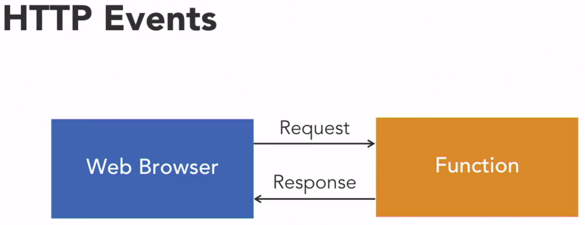
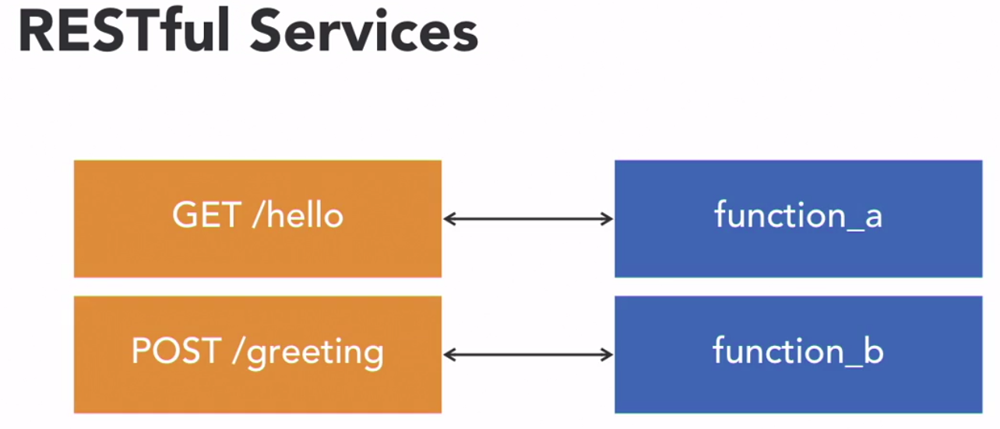

# This is the conspect about Chalice Framework

### Serverless application
Functions as a service = FaaS
* Pay as you go
* Scalability
* Productivity and leverage
* Security
#### This all was about AWS Lambda, but when is it not possible?
* Functions are **TRANSIENT**
    * Scaled up and down at will
    * No persistent local state
* Runtime Limitations
    * Total time
    * Memory
    * Payload size
    * Deployment size
    * Local disk size

### This all tell us about ***event driven*** property of serverless app's
Something heppens --> Function triggers --> Process event --> Kick back

## Functions as Building Blocks
We can write our logic steps without effecting on other step lines

Using Step Functions we can create complex workflows with logic, our handling, retries and manual presteps

### The recomended way for building service APIs is using Amazon's API Gateway service. What is it?
* Service for creating REST APIs
* Authentification, throttling, cachingm monitoring, logging
* Gloval, scalable
* Pay as you go
### API Gateway is created for RESTful Services

### And we have Chalice Framework and API Gateway which will help us to :
* Chalice handles API gateway configuration
* Focus on writing functions

###API Gateway
Lambda Authorizers это гибкий механизм позволяющий управлять
который передаёт контроль доступом для lambda функции которую мы обеспечиваем этим контролем. Chalice makes it really easy to specify and 
use custom authorizers, and we'll dig into an example

####Cognito
* Это AWS authentication and authorization service
* User management, including signup, sign-in
* Temporary IAM credentials for AWS acceess

####Usage Plans and API keys
* Throttling, quotas, and usage tracking based on an API key
* Usage plans to manage limits and access

