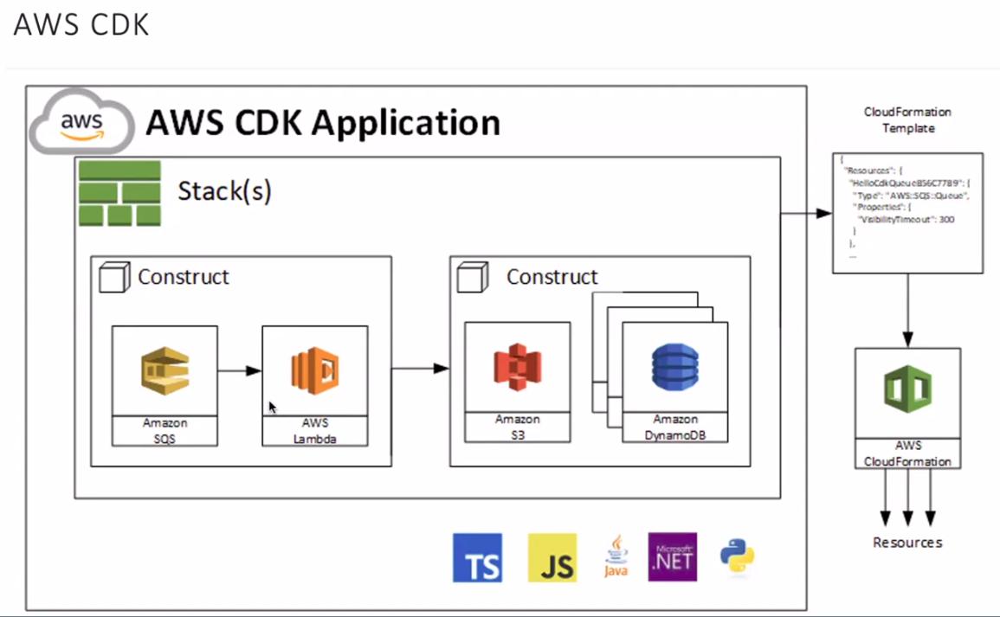

#Это лекция о деплое в облако AWS
##Где вообще можно запустить наше приложение на AWS
* AWS EC2 - базовая виртуальная машина
* AWS Elastic Beanstalk - Помогает autoscale для вашего контейнера, он сам это делает (для простых вебсервисов)
* AWS EC2 Conteiner Service(ECS) - Помогает работать с контейнерами ближе. Нужно чуть больше DevOps'ов
* Amazon Glue(PySpark) - Хочу такой кластер, столько notes и позволяет работать с PySpark
* AWS Lambda - Serverless с рантаймом, есть точко старта включая веб приложения (Flask, Django)- не требовательные к ресурсам. 
* Amazon Step Functions - Тоже serverlest похоже на lambda, но более сложый workflow. Позволяет бороться визуально увидеть что куда передаётся

## How to deploy Serverless apps
* В октябре  2015 выкатили Serverless Framework поддерживает JS, Python and etc.
* Zappa Framework бесплатный и опенсоурсный написанный на Python. Можно деплоить веб сервисы. Поддерживается Django, Flask, Bottle(any WSGI-compatible). + и одновременно минус(но не для нас), Zappa поддерживает только Python
* AWS Chalice - библиотека для написания безсерверного на питоне. Позволяет быстро создавать и деплоить в AWS, можно сказать клон вышенаписанного
* AWS SAM - Опесоурсный фреймворк который позволяет билдить безсервесные приложения в AWS, клон Serverless Framework
* AWS CloudFormation - универсальная тулза для деплоя в AWS, но, поддерживает только YAML/JSON.
* AWS CDK тоже опенсоурсный проект который помогает немного автоматизировать AWS CloudFormation. Поддерживает большое количество языков, но достаточно сложен в документировании. Пишем, ресурсы нужные. Мы пишем код на питоне, вместо Json / yaml. Но в конце оно преобразовывается в AWS Cloudformation.


1. Всё что мы деплоим получается находится в стеке, он может быть один или nested стэки.
2. Когда мы объявляем конструкцию, каждая конструкция будет связана с инструкцией или действием внутри Amazon'a. Передача параметров на уровне языка. Но результат всё же в Cloud Formation.

CDK позволит вам из 20 строк на Python сгенерировать 500 строк CloudFormation, который в лучае не использования CDK придёться писать в ручную. Задумайтесь!

Задеплоить стек можно командой:
``` bash
    cdk deploy 
```

Нужно каждый микросервис класть в одтельный nested стэк.
Было много ещё чего, чего я мало понял. Но надеюсь всё можно исправить.

