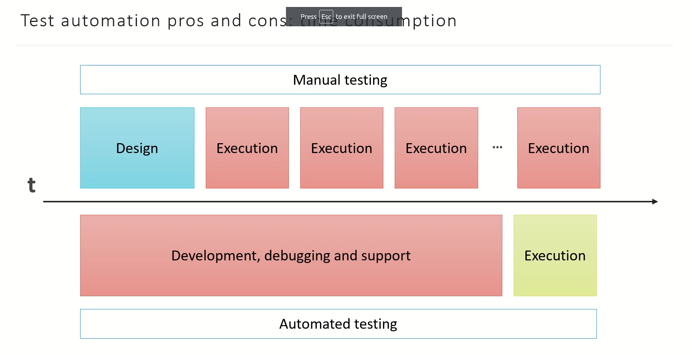
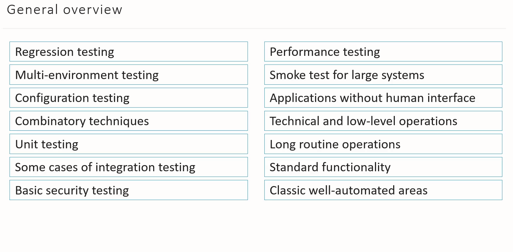

# What is test automation
**Test automation** - the use of software to perform or support test activities for e.g. test management, test design, test execution and results checking.
**Test automation framework** - a tool that provides an environment for test automation. It usually includes a test harness and test libraries.
**Test harness** - a test environment comprised of stubs and drivers needed to execute test.

A lot of people think that test automation can replace people entirely, but that is not true yet. Look at the picture bellow


This is the difference between Manual and automated testing

##### Test automation pros and cons: some factors to consider when choosing
- Time (manual vs automated)
- Time to repeat
- Support effort
- Staff

##### Pros of test automation:
- Speed
- Reliability (Computer have to human mistakes)
- Power
- Statistics 
- Low-level actions

##### Cons of test automation:
- Stuff (specialist of test automation)
- Strategy (wrong things cost so much to redo or to refactor strategy)
- Tools
- Changes (also causes a lot of pain it developing new test cases)
- Hopes :) 

##### Local conclusion
- Useful approach if managed wisely
- Become more and more required
- Manual testing still stays on the stage
- Automation not really replaces manual testing

# Areas of test automation

```Here we can talk about how do automation work in each areas```

#### But be aware of:
- Complex user interface
- Huge unstable technology domain
- Usability and other human-related things
- Unstable requirements


# Some tips on test automation
- More *details* to cases that should be automated
- Miscellaneous tools/systems that no one can understand
- You should mention about *Timing synchronization*
- You shouldn't hardcode variables to the test automation
- Test independence - the main point
- **And remember The automation is PROGRAMMING**
- Understanding a tool which you work with!
- ***ACTIONS and CHECKS are NOT THE SAME!***
#### Action - is a step for ex.:
- Enter the X value into Y field.
- Click the A link on the B page.
- Fill all fields of the form K on the page M with valid values.
- And etc...
#### Check are observations - it doesn't change anything in our application ex.:
- Check that the Y field contains the X value.
- Check that the B page contain the A link.
- Check that the page M contains the form K.
- Check some other things...

## Use proper data sources
### When we automate test we should use *a lot of data...*
- Random values
- Values generation with some algorithm
- Trusted external data sources(web-services, DB, etc)
- Real existing user data
- Manual generation

# Record and Playback Technology
### Pros&Cons
#### Pros
- Easy to learn
- Quick test skeleton creation
- Auto-gethering of technical details
- Routine actions auto-recording

#### Cons
- No, "if's", "cycles", "subroutines"
- **EVERY** action is recorded
- Hardcoding
- Meaningless variable names

# SeleniumIDE itself
Is an integrated development enviroment for Selenium scripts. It is implemented as a Chrome and Firefox extension, and allows you to record, edit, and debug tests. [seleniumIDE site](https://www.seleniumhq.org)

Task:
- Open [Link](https://selenium.dev)
- Click the "Projects" link
- Click the "Learn more" link in "Selenium IDE" section
- Check that the page contains the followit text: "Selenium IDE has plugin support"